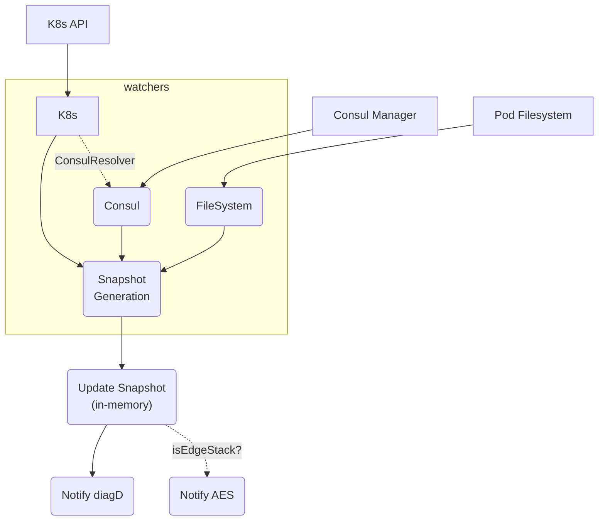

# Emissary-Ingress Architecture

In this document you will find information about the internal design and architecture of the Emissary-ingress (formerly known as Ambassador API Gateway). Emissary-ingress provides a Kubernetes-native load balancer, API gateway and ingress controller that is built on top of [Envoy Proxy](https://www.envoyproxy.io).

> Looking for end user guides for Emissary-ingress? You can check out the end user guides at <https://www.getambassador.io/docs/emissary/>.

## Table of Contents

- [Table of Contents](#table-of-contents)
- [Overview](#overview)
- [Custom Resource Definitions (CRD)](#custom-resource-definitions-crd)
  - [Apiext](#apiext)
  - [Additional Reading](#additional-reading)
- [Emissary-ingress Container](#emissary-ingress-container)
  - [Startup and Busyambassador](#startup-and-busyambassador)
  - [Entrypoint](#entrypoint)
    - [Watch All The Things (Watt)](#watch-all-the-things-watt)
- [Diagd](#diagd)
- [Ambex](#ambex)
- [Envoy](#envoy)
- [Testing Components](#testing-components)
  - [kat-client](#kat-client)
  - [kat-server](#kat-server)

## Overview

Emissary-ingress is a Kubernetes native API Gateway built on top of Envoy Proxy. We utilize Kubernetes CRDs to provide an expressive API to configure Envoy Proxy to handle routing traffic into your cluster.

Check [this blog post](https://blog.getambassador.io/building-ambassador-an-open-source-api-gateway-on-kubernetes-and-envoy-ed01ed520844) for additional context around the motivations and architecture decisions made for Emissary-ingress.

At the core of Emissary-ingress is Envoy Proxy which has very extensive configuration and extensions points. Getting this right can be challenging so Emissary-ingress provides Kubernetes Administrators and Developers a cloud-native way to configure Envoy using declarative yaml files. Here are the core components of Emissary-Ingress:

- CRDs - extend K8s to enable Emissary-ingress's abstractions (*generated yaml*)
- Apiext - A server that implements the Webhook Conversion interface for CRD's (**own container**)  
- Diagd - provides diagnostic ui, translates snapshots/ir into envoy configuration (*in-process*)
- Ambex - gRPC server implementation of envoy xDS for dynamic envoy configration (*in-process*)
- Envoy Proxy - Proxy that handles routing all user traffic (*in-process*)
- Ambassador Agent - provides connectivity between cluster and Ambassador Cloud.  (*own container*)

## Custom Resource Definitions (CRD)

Kubernetes allows extending its API through the use of [Customer Resource Definitions](https://kubernetes.io/docs/tasks/extend-kubernetes/custom-resources/custom-resource-definitions/) (aka CRDs) which allow solutions like Emissary-ingress to add custom resources to K8s and allow developers to treat them like any other K8s resource. CRDs provide validation, strong typing, structured data, versioning and are persisted in `etcd` along with the core Kuberenetes resources.

Emissary-ingress provides a set of CRD's that are applied to a cluster and then are watched by Emissary-ingress. Emissary-ingress then uses the data from these CRD's along with the standard K8's resources (services, endpoints, etc...) to dynamically generate Envoy Proxy configuration. Depending on the version of Emissary-ingress there might be multiple versions of the CRD's that are suppported.

You can read the user documentation (see additional reading below) to find out more about all the various CRDs that are used and how to configure them. For understanding, how they are defined you can take a look in `pkg/getambassador.io/*` directory. In this directory, you will find a directory per version of the CRDs and for each version you will see the `Golang` structs that define the data structures that are used for each of the Emissary-ingress custom resources. It's recommended to read the `doc.go` file for information about API guidelines followed and how the comment markers are used by the build system.

The build system (`make`) uses [controller-gen](https://book.kubebuilder.io/reference/controller-gen.html) to generate the required YAML representation for the customer resources that can be found at `pkg/getambassador.io/crds.yaml`. This file is auto-generated and checked into the respository. This is the file that is applied to a cluster extending the Kubernetes API. If any changes are made to the custom resources then it needs to be re-generated and checked-in as part of your PR. Running `make generate` will trigger the generation of this file and other generated files (`protobufs`) that are checked into the respository as well. If you want to see more about the build process take a look at `build-aux/generate.mk`.

> **Annotations**:  K8s allows developers to provide Annotations as well to the standard K8s Resources (Services, Ingress, etc...). Annotations were the preferred method of configuring early versions of Emissary-ingress but annotations did not provide validation and can be error prone. However, with the introduction of CRD's these are now the preferred method and annotations are only supported for backwards compatibility. We won't discuss the annotations much here due to this but rather making you aware that they exist.

### Apiext

Kubernetes provides the ability to have multiple versions of Custom Resources similiar to the core K8s resources but it is only capable of having a single `storage` version that is persisted in `etcd`. Custom Resource Definitions can define a `ConversionWebHook` that Kubernetes will call whenever it receives a version that is not the storage version. 

You can check the current storage version by looking at `pkg/getambassador.io/crds.yaml` and searching for the `storage: true` field and seeing which version is the storage version of the custom resource (*at the time of writing this it is `v2`*).

The `apiext` container is the Emissary-ingress's server implementation for the conversion webhook that is registered with our custom resources. Each custom resource will have a section similiar to the following in the `pkg/getambassador.io/crds.yaml`:

```yaml
conversion:
    strategy: Webhook
    webhook:
      clientConfig:
        service:
          name: emissary-apiext
          namespace: emissary-system
      conversionReviewVersions:
      - v1beta1
```

This is telling the Kubernetes API Server to call a WebHook using a `Service` within the cluster that is called `emissary-apiext` that can be found in the `emissary-system` namespace. It also states that our server implementation as of writing this guide only supports `v1beta1` of the WebHook so the K8s API Server will send the request and expect the response in the format for `v1beta1`.

The implementation of the `apiext` server can be found in `cmd/apiext` and it leverages the [controller-runtime](https://pkg.go.dev/sigs.k8s.io/controller-runtime@v0.11.2starts) library which is vendored in `vendor/sigs.k8s.io/controller-runtime`. When this process starts up it will do the following:

1. Register the Emissary-Ingress CRD schemas using the Go structs described previously
2. Ensure a self-signed certificate is generated that our server can register with for `https`.
3. Kick off a Go routine that handles watching our CRD's and enriching the WebHook Conversion section (*outlined in yaml above*) so that it includes our self-signed certs, port and path that the apiext server is listening on.
4. Starts up our two servers one for container liveness/readiness probes and one for the WebHook implementation that performs the conversion between CRD versions.

### Additional Reading

- [Ambassador Labs Docs - Custom Resources](https://www.getambassador.io/docs/emissary/latest/topics/running/host-crd/)
- [Ambassador Labs Docs - Declarative Configuration](https://www.getambassador.io/docs/emissary/latest/topics/concepts/gitops-continuous-delivery/#policies-declarative-configuration-and-custom-resource-definitions)
- [K8s Docs - Custom Resouce Definition](https://kubernetes.io/docs/tasks/extend-kubernetes/custom-resources/custom-resource-definitions/)
- [K8s Docs - Version CRD's](https://kubernetes.io/docs/tasks/extend-kubernetes/custom-resources/custom-resource-definition-versioning/)
- [K8s Docs - Webhook Conversion](<https://kubernetes.io/docs/tasks/extend-kubernetes/custom-resources/custom-resource-definition-versioning/#webhook-conversion>)

## Emissary-ingress Container

One of the major goals of the Emissary-ingress is to simplify the deployment of Envoy Proxy in a cloud-native friendly way using containers and declarative CRD's. To honor this goal Emissary-ingress is packaged up into a single image with all the necessary components.

This section will give a high-level overview of each of these components and will help provide you direction on where you can find more information on each of the components.

### Startup and Busyambassador

Emissary-ingress has evolved over many years, many contributors and many versions of Kubernetes which has led to the internal components being implemented in different programming languages. Some of the components are pre-built binaries like envoy, first-party python programs and first-party golang binaries. To provide a single entrypoint for the container startup the Golang binary called `busyambassador` was introduced.

/buildroot/ambassador/python/entrypoint.sh

The `busyambassador` binary provides a busybox like interface that dispatches the CMD's that are provided to a container for the various configured Golang binaries. This enables a single image to support multiple binaries on startup that are declartively set within a `deployment` in the `command` field when setting the image for a deployment. An example of this can be seen in the `ambassador-agent` deployment.

The image takes advantage of the `ENTRYPOINT` and `CMD` fields within a docker image manifest. You can see this in `builder/Dockerfile` in the final optimized image on the last line there is `ENTRYPOINT [ "bash", "/buildroot/ambassador/python/entrypoint.sh" ]`. This entrypoint cannot be overriden by the user and will run that bash script. By default the bash script will run the `entrypoint` binary which will be discussed in the next section but if passed a known binary name such as the `agent` example then `busyambassador` will run the correct command.

To learn more about `busyambassador` the code can be found:

- `cmd/busyambassador`
- `pkg/busy`

> Note: the bash script will just exec into the `busyambassador` Golang binary in most cases and is still around for historical reasons and advanced debugging scenarios.

> Additional Reading: If you want to know more about how containers work with entrypoint and commands then take a look at this blogpost. <https://www.bmc.com/blogs/docker-cmd-vs-entrypoint/>

### Entrypoint

The `entrypoint` Golang binary is the default binary that `busyambassador` will run on container startup. It is the parent process for all the other processes that are run within the single `ambassador` image for Emissary-Ingress. At a high-level it starts and manages multiple go-routines, starts other child processes such as `diagd` (python program) and `envoy` (c++ compiled binary).

Here is a list of everything managed by the `entrypoint` binary. Each one is indicated by whether its a child OS process that is started or a goroutine (*note: some of the OS processes are started/managed in goroutines but the core logic resides within the child process thus they are marked as such*).

| Description                                                               |     Goroutine      |      OS.Exec       |
| ------------------------------------------------------------------------- | :----------------: | :----------------: |
| `demomode` (*if enabled*)                                                 | :white_check_mark: |                    |
| `diagd` - admin ui & config processor                                     |                    | :white_check_mark: |
| `ambex` - the Envoy ADS Server                                            | :white_check_mark: |                    |
| `envoy` - proxy routing data                                              |                    | :white_check_mark: |
| SnapshotServer  - expose in-memory snapshot over localhost                | :white_check_mark: |                    |
| ExternalSnapshotServer - Ambassador Cloud friendly exposed over localhost | :white_check_mark: |                    |
| HealthCheck -  endpoints for K8s liveness/readiness probes                | :white_check_mark: |                    |
| Watt - Watch k8s, consul & files for cluster changes                      | :white_check_mark: |                    |
| Sidecar Processes - start various side car processes                      |                    | :white_check_mark: |

Some of these items will be discussed in more detail but the best places to get started looking at the `entrypoint` is by looking at `cmd/entrypoint/entrypoint.go`.

> To see how the container passes `entrypoint` as the default binary to run on container startup you can look at `python/entrypoint.sh` where it calls `exec busyambassador entrypoint "$@"` which will drop the shell process and will run the entrypoint process via busyambassador.

#### Watch All The Things (Watt)

Watch All The Things (aka Watt) is tasked with watching alot of things, hence the name :smile:. Specifically, its job is to watch for changes in the K8s Cluster and potentially Consul and file system changes. Watt is the beginning point for the end-to-end data flow from developer applying the configuration to envoy being configured. You can find the code for this in the `cmd/entrypoint/watcher.go` file.

The watching of the K8s Cluster changes is where Emissary-ingress will get most of its configuration by looking for K8s Resources (e.g. services,ingresss, etc...) as well as the Emissary-ingress CRD Resources (e.g. Host, Mapping, Listeners, etc...). A `consulWatcher`  will be started if a user has configured a Mapping to use the `ConsulResolver`. You can find this code in `cmd/entrypoint/consul.go`. The filesystem is also watched for changes to support `istio` and how it mounts certificates to the filesystem.

Here is the general flow:



## Diagd

Provides two main functions:

1. A Diagnostic Admin UI for viewing the current state of Emissary-Ingress
2. Processing Cluster changes into Envoy ready configuration
   1. This process has all the steps i'm outlining below

  - receives "CONFIG" event and pushes on queue
  - event queue loop listens for commands and pops them off
  - on CONFIG event it calls back to emissary Snapshot Server to grab current snapshot stored in-memory
  - It is serialized and stored in `/ambassador/snapshots/snapshot-tmp.yaml`.
  - A SecretHandler and Config is initialized
  - A ResourceFetcher (aka, parse the snapshot into an in-memory representation)
  - Generate IR and envoy configs (load_ir function)
    - Take each Resource generated in ResourceFetcher and add it to the Config object as strongly typed objects
    - Store Config Object in `/ambassador/snapshots/aconf-tmp.json`
    - Check Deltas for Mappings cach and determine if we needs to be reset
    - Create IR with a Config, Cache, and invalidated items
      - IR is generated which basically just converts our stuff to strongly typed generic "envoy" items (handling filters, clusters, listeners, removing duplicates, etc...)
    - IR is updated in-memory for diagd process
    - IR is persisted to temp storage in `/ambassador/snapshots/ir-tmp.json`
    - generate envoy config from IR and cache
    - Split envoy config into bootstrap config, ads_config and clustermap config
    - Validate econfig
    - Rotate Snapshots for each of the files `aconf`, `econf`, `ir`, `snapshot` that get persisted in the snapshot path `/ambassador/snapshots`.
      - Rotating them allows for seeing the history of snapshots up to a limit and then they are dropped
      - this also renames the `-tmp` files written above into 
    - Persist bootstrap, envoy ads config and clustermap config to base directory:
      - `/ambassador/bootstrap-ads.json` # this is used by envoy during startup to initial config itself and let it know about the static ADS Service
      - `/ambassador/enovy/envoy.json` # this is used in `ambex` to generate the ADS snapshots along with the fastPath items
      - `/ambassador/clustermap.json` # this might not be used either...
    - Notify `envoy` and `ambex` that a new snapshot has been persisted using signal SIGHUP
      - the Goroutine within `entrypoint` that starts up `envoy` is blocking waiting for this signal to start envoy
      - the `ambex` process continuously listens for this signal and it triggers a configuration update for ambex.
    - Update the appropriate status fields with metatdata by making calls to the `kubestatus` binary found in `cmd/kubestatus` which handles the communication to the cluster

## Ambex

This is the gRPC server implementation of the envoy xDS v2 and v3 api's based on ...

- listens for SIGHUP from diagd
- converts `envoy.json` into in-memory snapshots that are cached for v2/v3
- implements ADS v2/v3 Apis that envoy is configured to listen to

## Envoy

We maintain our own [fork](https://github.com/datawire/envoy) of Envoy that includes some additional commits for implementing some features in Emissary-Ingress.

Envoy does all the heavy-lifting
- does all routing, filtering, TLS termination, metrics collection, tracing, etc...
- It is bootstraps from the output of diagd
- It is dynamically updated using the xDS services and specifically the ADS service
  - Our implementation of this is `ambex`

## Testing Components

TODO: talk about testing performed by kat-client/kat-server.

### kat-client

TODO: discuss the purpose of kat-client

### kat-server

TODO: discuss the purpose of kat-client
