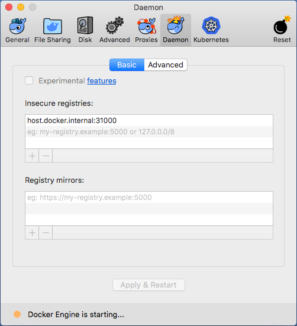

# Ambassador Pro 

This is the proprietary Ambassador Pro source-code.  The public
user-facing documentation and issue-tracking lives at
<https://github.com/datawire/ambassador-pro>.

## CI/CD and manual release

### Continuous Integration

On every Git branch, tag, and pull request, CircleCI runs:
 - the `go test` unit tests on Ubuntu and macOS
 - the e2e tests on Ubuntu+Kubernaut+`ambassador-oauth-e2e.auth0.com`

It does NOT push Docker images to any persistent registry for normal
CI runs (it pushes the test images to an ephemeral registry inside of
the Kubernaut cluster).

### Continuous Deployment

On Git tags matching `vX.Y.Z[-PRE]` (for integers `X`, `Y`, `Z`, and
arbitrary string `PRE`), CircleCI does the the
[above](#continuous-integration), and (assuming the tests pass),
proceeds to:
 - push `apictl` and `apictl-key` for Linux and Darwin to AWS S3
 - push all 4 Docker images to
   [`quay.io/datawire/ambassador_pro`](https://quay.io/repository/datawire/ambassador_pro?tab=tags)

### Manual release

If you would like to push a development version without tagging a
release or pre-release, you may run

    $ make release

which will build and push a release with the pseudo-version generated
by `git describe --tags`.  You will need the appropriate Quay and AWS
credentials.

## Local development

### Building

    $ make build

This will build
 - all executable programs, which it will put in
   `./bin_$(go env GOOS)_$(go env GOARCH)/`
 - all Docker images, which it will tag as
   `localhost:31000/$(IMAGE_NAME):$(VERSION)` (or
   `host.docker.internal:31000` on macOS).

### Testing

    $ # if on macOS, first you must configure dockerd, see below
    $ export KUBERNAUT_TOKEN=...
    $ make check

This will run both unit tests and e2e tests.

 > *NOTE:* This will talk to the Auth0 account configured in
 > `./k8s-env.sh`.  The login credentials for that Auth0 can be found
 > in Keybase under `/datawireio/global/ambassador-oauth-ci.txt`.

On macOS, you will first need to add `host.docker.internal:31000` to
Docker's list of "Insecure registries":

## Cutting a release

When you've identified a commit that you believe should be a release
(preferably on `master` that CI has already identified as passing),
simply create a Git tag, and push that Git tag.  e.g.:

    $ git tag v0.1.2-rc3
    $ git push origin v0.1.2-rc3

See [Continuous Deployment](#continuous-deployment) above for
information on what this does, and on the format of the tag names.

## How users get this

The installation instructions have users create a secret with
credentials for a Quay account named `datawire+ambassador_pro` that
has read permissions in the `quay.io/datawire/ambassador_pro`
registry.  This secret is then used to authorize the image pull in the
deployment (see below).  These deployments can currently be found in
the `/templates/ambassador` directory on the `Ambassador` repo in the
`nkrause/AmPro/auth-docs` branch (TODO: Can we get a hyperlink in
here?).

## TODO:

 - Merge `./k8s-*/` in to just `./k8s-sidecar/` and
   `./k8s-standalone/`.
 - Each `./k8s-*/` directory should deploy in to a different
   namespace.
