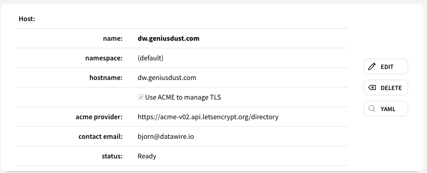
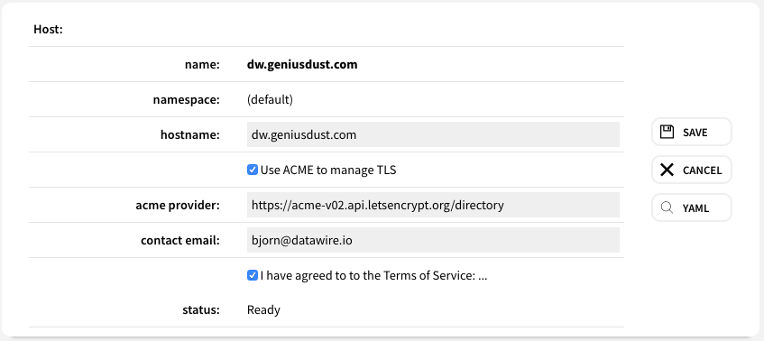

# Views and Custom Web-Components

The instances of `IResourceView` and `IResourceColelctionView` are 
[lit-element](https://lit-element.polymer-project.org/) custom web-components
and are inserted into the browser's DOM just like any other DOM element.

However, our views have one design characteristic that might seem confusing at first: each view has 
two sets of DOM elements for each model variable: a read-only DOM element and a writeable form-field DOM element.
These two elements for each model variable are alternately hidden and displayed such that only one of the two
is visible at any moment. Thus when the view is being just displayed (not edited), the normal `` and `
`
DOM elements are visible and the form-field DOM elements are hidden. And then when the view is being edited, the
normal DOM elements are hidden and the form-field DOM elements are visible. The net effect is that the 
view fields look like they change from read-only to writeable and back again:

To make this magic work, your view subclass, has to do two things:

1. It has to manage the two sets of DOM elements and instance variables and ensure that the same values
are reflected in both sets. For example, see [HostView](../views/host_view.js) methods `readSelfFromModel()` and
`writeSelfToModel()`.

2. It has render only one set of the DOM elements at a time. For example, see  [HostView](../views/host_view.js) method
`renderSelf()` where there is a `${this.hostname}`
followed by a `<input class="${this.visibleWhen("edit", "add")}" .../>`. The visibleWhen lists must be mutually
exclusive between the `span` and the `input` elements.
