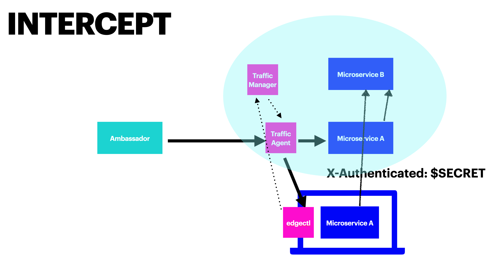

# Service Preview and Edge Control

One of the challenges in adopting Kubernetes and microservices is the development and testing workflow. Creating and maintaining a full development environment with many microservices and their dependencies is complex and hard.

Service Preview addresses this challenge by connecting your CI system or local development infrastructure to the Kubernetes cluster, and dynamically routing specific requests to your local environment.

## Service Preview in action



When Service Preview is used, incoming requests get routed by Ambassador to a Traffic Agent, which then routes traffic to the microservice. When a request meets a specific criteria (e.g., it has a specific HTTP header value), the Traffic Agent will route that request to the microservice running locally.

There are three main components to Service Preview:

1. The Traffic Agent, which controls routing to the microservice. The Traffic Agent is deployed as a sidecar on the same pod as your microservice (behind the scenes, it's a special configuration of the basic Ambassador Edge Stack image).

2. The Traffic Manager, which manages the different instances of the Traffic Agent, and is deployed in the cluster.

3. The Edge Control local client, which runs in your local environment (Linux or Mac OS X). The client is the command line interface to the Traffic Manager.

## Configuring Service Preview

To get started with Service Preview, you'll need to install Traffic Manager, configure a Traffic Agent, and then download and install the `edgectl` client.

### Traffic Manager

The Traffic Manager is the central point of communication between Traffic Agents in the cluster and Edge Control Daemons on developer workstations.


1. Ensure that you have a valid Ambassador Edge Stack license key installed in your cluster.
2. Save the manifest below into a file called `traffic-manager.yaml`.
3. Apply the manifest to your cluster with `kubectl apply -f traffic-manager.yaml`.

```yaml
# This is traffic-manager.yaml
---
apiVersion: v1
kind: Service
metadata:
  name: telepresence-proxy
  namespace: ambassador
spec:
  type: ClusterIP
  clusterIP: None
  selector:
    app: telepresence-proxy
  ports:
    - name: sshd
      protocol: TCP
      port: 8022
    - name: api
      protocol: TCP
      port: 8081
---
apiVersion: apps/v1
kind: Deployment
metadata:
  name: telepresence-proxy
  namespace: ambassador
  labels:
    app: telepresence-proxy
spec:
  replicas: 1
  selector:
    matchLabels:
      app: telepresence-proxy
  template:
    metadata:
      labels:
        app: telepresence-proxy
    spec:
      containers:
      - name: telepresence-proxy
        image: quay.io/datawire/aes:$version$
        command: [ "traffic-manager" ]
        ports:
          - name: sshd
            containerPort: 8022
        env:
          - name: AMBASSADOR_LICENSE_FILE
            value: /.config/ambassador/license-key
        volumeMounts:
          - mountPath: /tmp/ambassador-pod-info
            name: ambassador-pod-info
          - mountPath: /.config/ambassador
            name: ambassador-edge-stack-secrets
            readOnly: true
      restartPolicy: Always
      terminationGracePeriodSeconds: 0
      volumes:
      - downwardAPI:
          items:
          - fieldRef:
              fieldPath: metadata.labels
            path: labels
        name: ambassador-pod-info
      - name: ambassador-edge-stack-secrets
        secret:
          secretName: ambassador-edge-stack
```

### Traffic Agent

Any microservice running in a cluster with a traffic manager can opt in to intercept functionality by including the Traffic Agent in its pods.

1. Since the Traffic Agent is built on Ambassador Edge Stack, it needs the same RBAC permissions that Ambassador does. The easiest way to provide this is to create a `ServiceAccount` in your service's namespace, bound to the `ambassador` `ClusterRole`:

```yaml
---
apiVersion: v1
kind: ServiceAccount
metadata:
  name: traffic-agent
  namespace: default
  labels:
    product: aes
---
apiVersion: rbac.authorization.k8s.io/v1beta1
kind: ClusterRoleBinding
metadata:
  name: traffic-agent
  labels:
    product: aes
roleRef:
  apiGroup: rbac.authorization.k8s.io
  kind: ClusterRole
  name: ambassador
subjects:
- kind: ServiceAccount
  name: traffic-agent
  namespace: default
```

(If you want to include the Traffic Agent with multiple services, they can all use the same `ServiceAccount`.)

Copy the above YAML into `traffic-agent-rbac.yaml` and, if necessary, edit the two `namespace`s appropriately. Apply it:

```bash
$ kubectl apply -f traffic-agent-rbac.yaml
serviceaccount/traffic-agent created
clusterrolebinding.rbac.authorization.k8s.io/traffic-agent created
```

2. Next, you'll need to modify the YAML for each microservice to include the Traffic Agent. We'll start with a set of manifests for a simple microservice:

```yaml
# This is hello.yaml
---
apiVersion: v1
kind: Service
metadata:
  name: hello
  labels:
    app: hello
spec:
  selector:
    app: hello
  ports:
    - protocol: TCP
      port: 80
      targetPort: 8000              # Application port
---
apiVersion: apps/v1
kind: Deployment
metadata:
  name: hello
  labels:
    app: hello
spec:
  replicas: 1
  selector:
    matchLabels:
      app: hello
  template:
    metadata:
      labels:
        app: hello
    spec:
      containers:                   # Application container
        - name: hello
          image: datawire/hello-world:latest
          ports:
            - containerPort: 8000   # Application port
```

In order to run the sidecar:
- you need to include the Traffic Agent container in the microservice pod;
- you need to switch the microservice's `Service` definition to point to the Traffic Agent's listening port (either 8080 or 8443); and
- you need to tell the Traffic Agent how to set up for the microservice, using environment variables.

Here is a modified set of manifests that includes the Traffic Agent (with notes below):

```yaml
# This is hello-intercept.yaml
---
apiVersion: v1
kind: Service
metadata:
  name: hello
  labels:
    app: hello
spec:
  selector:
    app: hello
  ports:
    - protocol: TCP
      port: 80
      targetPort: 8080              # Traffic Agent port (note 1)
---
apiVersion: apps/v1
kind: Deployment
metadata:
  name: hello
  labels:
    app: hello
spec:
  replicas: 1
  selector:
    matchLabels:
      app: hello
  template:
    metadata:
      labels:
        app: hello
    spec:
      containers:
        - name: hello               # Application container (note 2)
          image: datawire/hello-world:latest
          ports:
            - containerPort: 8000   # Application port
        - name: traffic-agent       # Traffic Agent container (note 3)
          image: quay.io/datawire/aes:$version$ # see note 3
          ports:
            - containerPort: 8080   # Traffic Agent port
          env:
          - name: AGENT_SERVICE     # Name to use for intercepting (note 5)
            value: hello
          - name: AGENT_PORT        # Port on which to talk to the microservice (note 6)
            value: "8000"
          - name: AGENT_MANAGER_NAMESPACE # Namespace for contacting the Traffic Manager (note 7)
            value: ambassador
          - name: AMBASSADOR_NAMESPACE # Namespace in which this microservice is running (note 8)
            valueFrom:
              fieldRef:
                fieldPath: metadata.namespace
      serviceAccountName: traffic-agent
```

Key points include:

- **Note 1**: The `Service` now points to the Traffic Agent’s port (8080) instead of the application’s port (8000).
- **Note 2**: The microservice's application container is actually unchanged.
- **Note 3**: The Traffic Agent's container has been added.
- **Note 4**: The Traffic Agent is included in the AES image. You'll need to edit this to have the actual image name.
- **Note 5**: The `AGENT_SERVICE` environment variable is mandatory. It sets the name that the Traffic Agent will report to the Traffic Manager for this microservice: you will have to provide this name to intercept this microservice.
- **Note 6**: The `AGENT_PORT` environment variable is mandatory. It tells the Traffic Agent the local port on which the microservice is listening.
- **Note 7**: The `AGENT_MANAGER_NAMESPACE` environment variable tells the Traffic Agent the namespace in which it will be able to find the Traffic Manager. If not present, it defaults to the `ambassador` namespace.
- **Note 8**: The `AMBASSADOR_NAMESPACE` environment variable is mandatory. It lets the Traffic Agent tell the Traffic Manager the namespace in which the microservice is running. 

#### TLS Support

If other microservices in the cluster expect to speak TLS to this microservice, tell the Traffic Agent to terminate TLS:
- Set the `AGENT_TLS_TERM_SECRET` environment variable to the name of a Kubernetes Secret that contains a TLS certificate
- The Traffic Agent will terminate TLS on port 8443 (not port 8080) using the named certificate
- The Kubernetes Service above must point to port 8443, not 8080 (and not the application's port)

If this microservice expects incoming requests to speak TLS, tell the Traffic Agent to originate TLS:
- Set the `AGENT_TLS_ORIG_SECRET` environment variable to the name of a Kubernetes Secret that contains a TLS certificate
- The Traffic Agent will use that certificate originate HTTPS requests to the application
