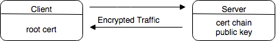
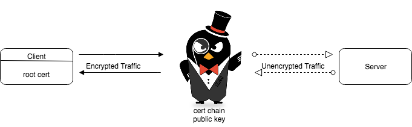
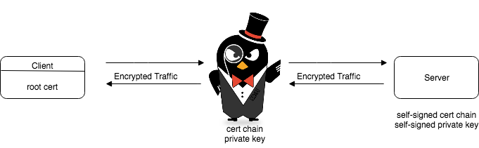

# Using gRPC and Ambassador

Ambassador Edge Stack makes it easy to access your services from outside your application. This includes gRPC services, although a little bit of additional configuration is required: by default, Envoy connects to upstream services using HTTP/1.x and then upgrades to HTTP/2 whenever possible. However, gRPC is built on HTTP/2 and most gRPC servers do not speak HTTP/1.x at all. Ambassador Edge Stack must tell its underlying Envoy that your gRPC service only wants to speak to that HTTP/2, using the `grpc` attribute of a `Mapping`.

## Writing a gRPC Service for Ambassador Edge Stack

There are many examples and walkthroughs on how to write gRPC applications so that is not what this article will aim to accomplish. If you do not yet have a service written you can find examples of gRPC services in all supported languages here: [gRPC Quickstart](https://grpc.io/docs/quickstart/)

This document will use the [gRPC python helloworld example](https://github.com/grpc/grpc/tree/master/examples/python/helloworld) to demonstrate how to configure a gRPC service with Ambassador Edge Stack.

Follow the example up through [Run a gRPC application](https://grpc.io/docs/quickstart/python.html#run-a-grpc-application) to get started.

### Dockerize

After building our gRPC application and testing it locally, we need to package it as a Docker container and deploy it to Kubernetes.

To run a gRPC application, we need to include the client/server and the protocol buffer definitions.

For gRPC with python, we need to install `grpcio` and the common protos.

```Dockerfile
FROM python:2.7

WORKDIR /grpc

ENV PATH "$PATH:/grpc"

COPY greeter_server.py /grpc
COPY helloworld_pb2.py /grpc
COPY helloworld_pb2_grpc.py /grpc

RUN python -m pip install grpcio
RUN python -m pip install grpcio-tools googleapis-common-protos

CMD ["python", "./greeter_server.py"]

EXPOSE 50051
```

Create the container and test it:

```shell
$ docker build -t <docker_reg>/grpc_example
$ docker run -p 50051:50051 <docker_reg>/grpc_example
```

Where `<docker_reg>` is your Docker user or registry.

Switch to another terminal and, from the same directory, run the `greeter_client`. The output should be the same as running it outside of the container.

```shell
$ docker run -p 50051:50051 <docker_reg>/grpc_example
Greeter client received: Hello, you!
```

Once you verify the container works, push it to your Docker registry:

```shell
$ docker push <docker_reg>/grpc_example
```

### Mapping gRPC Services

Ambassador Edge Stack `Mapping`s are based on URL prefixes; for gRPC, the URL prefix is the full-service name, including the package path (`package.service`). These are defined in the `.proto` definition file. In the example [proto definition file](https://github.com/grpc/grpc/blob/master/examples/protos/helloworld.proto) we see:

```
package helloworld;

// The greeting service definition.
service Greeter { ... }
```

so the URL `prefix` is `helloworld.Greeter` and the mapping would be:

```yaml
apiVersion: getambassador.io/v2
kind: Mapping
metadata:
  name: grpc-py
spec:
  grpc: True
  prefix: /helloworld.Greeter/
  rewrite: /helloworld.Greeter/
  service: grpc-example
```

Note the `grpc: true` line - this is what tells Envoy to use HTTP/2 so the request can communicate with your backend service. Also note that you'll need `prefix` and `rewrite` the same here, since the gRPC service needs the package and service to be in the request to do the right thing.

### Deploying to Kubernetes

`grpc_example.yaml`

```yaml
---
apiVersion: getambassador.io/v2
kind: Mapping
metadata:
  name: grpc-py
spec:
  grpc: True
  prefix: /helloworld.Greeter/
  rewrite: /helloworld.Greeter/
  service: grpc-example

---
apiVersion: v1
kind: Service
metadata:
  labels:
    service: grpc-example
  name: grpc-example
spec:
  type: ClusterIP
  ports:
  - name: grpc-greet
    port: 80
    targetPort: grpc-api
  selector:
    service: grpc-example
---
apiVersion: apps/v1
kind: Deployment
metadata:
  name: grpc-example
spec:
  replicas: 1
  selector:
    matchLabels:
      service: grpc-example
  template:
    metadata:
      labels:
        service: grpc-example
    spec:
      containers:
      - name: grpc-example
        image: <docker_reg>/grpc_example
        ports:
        - name: grpc-api
          containerPort: 50051
      restartPolicy: Always
```

After adding the Ambassador Edge Stack mapping to the service, the rest of the Kubernetes deployment YAML file is pretty straightforward. We need to identify the container image to use, expose the `containerPort` to listen on the same port the Docker container is listening on, and map the service port (80) to the container port (50051).

Once you have the YAML file and the correct Docker registry, deploy it to your cluster with `kubectl`.

```shell
$ kubectl apply -f grpc_example.yaml
```

### Testing the Deployment

Make sure to test your Kubernetes deployment before making more advanced changes (like adding TLS). To test any service with Ambassador Edge Stack, we will need the hostname of the running Ambassador Edge Stack service which you can get with:

```shell
$ kubectl get service ambassador -o wide
```
Which should return something similar to:

```
NAME         CLUSTER-IP      EXTERNAL-IP     PORT(S)        AGE
ambassador   10.11.12.13     35.36.37.38     80:31656/TCP   1m
```
where `EXTERNAL-IP` is the `$AMBASSADORHOST` and 80 is the `$PORT`.

You will need to open the `greeter_client.py` and change `localhost:50051` to `$AMBASSADORHOST:$PORT`

```diff
- with grpc.insecure_channel('localhost:50051') as channel:
+ with grpc.insecure_channel(‘$AMBASSADORHOST:$PORT’) as channel:
        stub = helloworld_pb2_grpc.GreeterStub(channel)
        response = stub.SayHello(helloworld_pb2.HelloRequest(name='you'))
    print("Greeter client received: " + response.message)
```

After making that change, simply run the client again and you will see the gRPC service in your cluster respond:

```shell
$ python greeter_client.py
Greeter client received: Hello, you!
```

### gRPC and TLS

There is some extra configuration required to connect to a gRPC service through Ambassador Edge Stack over an encrypted channel. Currently, the gRPC call is being sent over cleartext to Ambassador Edge Stack which proxies it to the gRPC application.



If you want to add TLS encryption to your gRPC calls, first you need to tell Ambassador Edge Stack to add [ALPN protocols](../topics/running/tls/tls) which are required by HTTP/2 to do TLS.

For example:

```yaml
---
apiVersion: getambassador.io/v2
kind: TLSContext
metadata:
  name: tls
spec:
  hosts:
  - "*"
  secret: ambassador-cert
  alpn_protocols: h2
```

Next, you need to change the client code slightly and tell it to open a secure RPC channel with Ambassador Edge Stack.

```diff
- with grpc.insecure_channel(‘$AMBASSADORHOST:$PORT’) as channel:
+ with grpc.secure_channel(‘$AMBASSADORHOST:$PORT’, grpc.ssl_channel_credentials()) as channel:
        stub = helloworld_pb2_grpc.GreeterStub(channel)
        response = stub.SayHello(helloworld_pb2.HelloRequest(name='you'))
    print("Greeter client received: " + response.message)
```

`grpc.ssl_channel_credentials(root_certificates=None, private_key=None, certificate_chain=None)`returns the root certificate that will be used to validate the certificate and public key sent by Ambassador Edge Stack. The default values of `None` tells the gRPC runtime to grab the root certificate from the default location packaged with gRPC and ignore the private key and certificate chain fields. Generally, passing no arguments to the method that requests credentials gives the same behavior. Refer to the languages [API Reference](https://grpc.io/docs/) if this is not the case.  

Ambassador Edge Stack is now terminating TLS from the gRPC client and proxying the call to the application over cleartext.



If you want to configure authentication in another language, [gRPC provides examples](https://grpc.io/docs/guides/auth.html) with proper syntax for other languages.

#### Originating TLS with gRPC Service



Ambassador Edge Stack can originate TLS with your gRPC service so the entire RPC channel is encrypted. To configure this, first get some TLS certificates and configure the server to open a secure channel with them. Using self-signed certs this can be done with OpenSSL and adding a couple of lines to the server code.

```diff
def serve():
    server = grpc.server(futures.ThreadPoolExecutor(max_workers=10))
+   with open('certs/server.key', 'rb') as f:
+       private_key = f.read()
+   with open('certs/server.crt', 'rb') as f:
+       cert_chain = f.read()
+   server_creds = grpc.ssl_server_credentials( ( (private_key, cert_chain), ) )
    helloworld_pb2_grpc.add_GreeterServicer_to_server(Greeter(), server)
-   server.add_insecure_port('[::]:50052')
+   server.add_secure_port('[::]:50052', server_creds)
    server.start()
```

Rebuild your docker container **making sure the certificates are included** and follow the same steps of testing and deploying to Kubernetes. You will need to make a small change to the client code to test locally.

```diff
- with grpc.insecure_channel(‘localhost:$PORT’) as channel:
+ with grpc.secure_channel(‘localhost:$PORT’, grpc.ssl_channel_credentials(open('certs/server.crt', 'rb').read())) as channel:
        stub = helloworld_pb2_grpc.GreeterStub(channel)
        response = stub.SayHello(helloworld_pb2.HelloRequest(name='you'))
    print("Greeter client received: " + response.message)
```

Once deployed we will need to tell Ambassador Edge Stack to originate TLS to the application.

```yaml
---
apiVersion: getambassador.io/v2
kind: Mapping
metadata:
  name: grpc-py-tls
spec:
  grpc: True
  tls: upstream
  prefix: /hello.Greeter/
  rewrite: /hello.Greeter/
  service: https://grpc-py

---
apiVersion: v1
kind: Service
metadata:
  labels:
    service: grpc-py
  name: grpc-py
spec:
  type: ClusterIP
  ports:
  - name: grpc-greet
    port: 443
    targetPort: grpc-api
  selector:
    service: grpc-py
```

```yaml
---
apiVersion: getambassador.io/v2
kind: TLSContext
metadata:
  name: upstream
spec:
  alpn_protocols: h2
  secret: ambassador-cert
```

We need to tell Ambassador Edge Stack to route to the `service:` over https and have the service listen on `443`. We also need to tell Ambassador Edge Stack to use ALPN protocols when originating TLS with the application, the same way we did with TLS termination. This is done by setting `alpn_protocols: ["h2"]` in a `TLSContext` telling the service to use that tls-context in the mapping by setting `tls: upstream`.

Refer to the [TLS document](../topics/running/tls/origination#advanced-configuration-using-a-tlscontext) for more information on TLS origination.

### gRPC Headers

gRPC services use [HTTP/2 headers](https://github.com/grpc/grpc/blob/master/doc/PROTOCOL-HTTP2.md). This means that some header-based routing rules will need to be rewritten to support HTTP/2 headers. For example, `host: subdomain.host.com` needs to be rewritten using the `headers: ` attribute with the `:authority` header:

```
headers:
  :authority: subdomain.host.com
```

## Note

Some [Kubernetes ingress controllers](https://kubernetes.io/docs/concepts/services-networking/ingress/) do not support HTTP/2 fully. As a result, if you are running Ambassador with an ingress controller in front, you may find that gRPC requests fail even with correct Ambassador Edge Stack configuration.

A simple way around this is to use Ambassador Edge Stack with a `LoadBalancer` service, rather than an Ingress controller. You can also consider using [Ambassador Edge Stack as your Ingress Controller](../topics/running/ingress-controller).

## gRPC-Web

Ambassador Edge Stack also supports the [gRPC-Web](../topics/running/ambassador#grpc-web-enable_grpc_web) protocol for browser-based gRPC applications.
