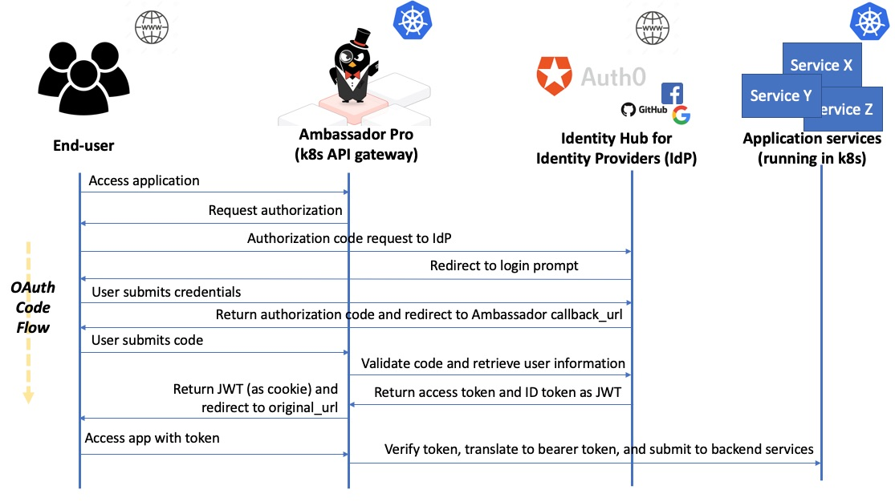

# The OAuth2 Filter

The `OAuth2` filter type performs OAuth2 authorization against an identity provider implementing [OIDC Discovery](https://openid.net/specs/openid-connect-discovery-1_0.html). The filter is both:

* An OAuth Client, which fetches resources from the Resource Server on the user's behalf.
* Half of a Resource Server, validating the Access Token before allowing the request through to the upstream service, which implements the other half of the Resource Server.

This is different from most OAuth implementations where the Authorization Server and the Resource Server are in the same security domain. With the Ambassador Edge Stack, the Client and the Resource Server are in the same security domain, and there is an independent Authorization Server.

## The Ambassador Authentication Flow

This is what the authentication process looks like at a high level when using Ambassador Edge Stack with an external identity provider. The use case is an end-user accessing a secured app service.



### Some basic authentication terms

For those unfamiliar with authentication, here is a basic set of definitions.

* OpenID: is an [open standard](https://openid.net/) and [decentralized authentication protocol](https://en.wikipedia.org/wiki/OpenID). OpenID allows users to be authenticated by co-operating sites, referred to as "relying parties" (RP) using a third-party authentication service. End-users can create accounts by selecting an OpenID identity provider (such as Auth0, Okta, etc), and then use those accounts to sign onto any website that accepts OpenID authentication.
* Open Authorization (OAuth): an open standard for [token-based authentication and authorization](https://oauth.net/) on the Internet. OAuth provides to clients a "secure delegated access" to server or application resources on behalf of an owner, which means that although you won't manage a user's authentication credentials, you can specify what they can access within your application once they have been successfully authenticated. The current latest version of this standard is OAuth 2.0.
* Identity Provider (IdP): an entity that [creates, maintains, and manages identity information](https://en.wikipedia.org/wiki/Identity_provider) for user accounts (also referred to "principals") while providing authentication services to external applications (referred to as "relying parties") within a distributed network, such as the web.
* OpenID Connect (OIDC): is an [authentication layer that is built on top of OAuth 2.0](https://openid.net/connect/), which allows applications to verify the identity of an end-user based on the authentication performed by an IdP, using a well-specified RESTful HTTP API with JSON as a data format. Typically an OIDC implementation will allow you to obtain basic profile information for a user that successfully authenticates, which in turn can be used for implementing additional security measures like Role-based Access Control (RBAC).
* JSON Web Token (JWT): is a [JSON-based open standard for creating access tokens](https://jwt.io/), such as those generated from an OAuth authentication. JWTs are compact, web-safe (or URL-safe), and are often used in the context of implementing single sign-on (SSO) within federated applications and organizations. Additional profile information, claims, or role-based information can be added to a JWT, and the token can be passed from the edge of an application right through the application's service call stack.

If you look back at the authentication process diagram, the function of the entities involved should now be much clearer.

### Using an Identity Hub

Using an identity hub or broker allows you to support many IdPs without having to code individual integrations with them. For example, [Auth0](https://auth0.com/docs/identityproviders) and [Keycloak](https://www.keycloak.org/docs/latest/server_admin/index.html#social-identity-providers) both offer support for using Google and GitHub as an IdP.

An identity hub sits between your application and the IdP that authenticates your users, which not only adds a level of abstraction so that your application (and Ambassador Edge Stack) is isolated from any changes to each provider's implementation, but it also allows your users to chose which provider they use to authenticate (and you can set a default, or restrict these options).

The Auth0 docs provide a guide for adding social IdP "[connections](https://auth0.com/docs/identityproviders)" to your Auth0 account, and the Keycloak docs provide a guide for adding social identity "[brokers](https://www.keycloak.org/docs/latest/server_admin/index.html#social-identity-providers)".


## `OAuth2` Global Arguments

```yaml
---
apiVersion: getambassador.io/v2
kind: Filter
metadata:
  name: "example-oauth2-filter"
  namespace: "example-namespace"
spec:
  OAuth2:
    authorizationURL:      "url-string"      # required
    grantType              "enum-string"     # optional; default is "AuthorizationCode"
    extraAuthorizationParameters:            # optional; default is {}
      "string": "string"

    accessTokenValidation: "enum-string"     # optional; default is "auto"
    accessTokenJWTFilter:                    # optional; default is null
      name: "string"                           # required
      namespace: "string"                      # optional; default is the same namespace as the Filter
      arguments: JWT-Filter-Arguments          # optional

    # Settings for grantType=="AuthorizationCode"
    clientURL:             "url-string"      # required
    clientID:              "string"          # required
    # A client secret must be specified.
    # This can be done by including the raw secret as a string in "secret",
    # or by referencing Kubernetes secret with "secretName" (and "secretNamespace").
    # It is invalid to specify both "secret" and "secretName".
    secret:                "string"          # required (unless secretName is set)
    secretName:            "string"          # required (unless secret is set)
    secretNamespace:       "string"          # optional; default is the same namespace as the Filter
    useSessionCookies:                       # optional; default is { value: false }
      value: bool                              # optional: default is true
      ifRequestHeader:                         # optional; default to apply "useSessionCookies.value" to all requests
        name: "string"                           # required
        negate: bool                             # optional; default is false
        # It is invalid to specify both "value" and "valueRegex".
        value: "string"                          # optional; default is any non-empty string
        valueRegex: "regex-string"               # optional; default is any non-empty string

    # HTTP client settings for talking with the identity provider
    insecureTLS:           bool              # optional; default is false
    renegotiateTLS:        "enum-string"     # optional; default is "never"
    maxStale:              "duration-string" # optional; default is "0"
```

General settings:

 - `authorizationURL`: Identifies where to look for the `/.well-known/openid-configuration` descriptor to figure out how to talk to the OAuth2 provider.
 - `grantType`: Which type of OAuth 2.0 authorization grant to request from the identity provider.  Currently supported are:
   * `"AuthorizationCode"`: Authenticate by redirecting to a login page served by the identity provider.
   * `"ClientCredentials"`: Authenticate by requiring `X-Ambassador-Client-ID` and `X-Ambassador-Client-Secret` HTTP headers on incoming requests, and using them to authenticate to the identity provider.  Support for the `ClientCredentials` is currently preliminary, and only goes through limited testing.
 - `extraAuthorizationParameters`: Extra (non-standard or extension) OAuth authorization parameters to use.  It is not valid to specify a parameter used by OAuth itself ("response_type", "client_id", "redirect_uri", "scope", or "state").
 - `accessTokenValidation`: How to verify the liveness and scope of Access Tokens issued by the identity provider.  Valid values are either `"auto"`, `"jwt"`, or `"userinfo"`.  Empty or unset is equivalent to `"auto"`.
   * `"jwt"`: Validates the Access Token as a JWT.
     + By default: It accepts the RS256, RS384, or RS512 signature algorithms, and validates the signature against the JWKS from OIDC Discovery.  It then validates the `exp`, `iat`, `nbf`, `iss` (with the Issuer from OIDC Discovery), and `scope` claims: if present, none of the scopes are required to be present.  This relies on the identity provider using non-encrypted signed JWTs as Access Tokens, and configuring the signing appropriately
     + This behavior can be modified by delegating to [`JWT` Filter](#filter-type-jwt) with `accessTokenJWTFilter`. The arguments are the same as the arguments when referring to a JWT Filter from a FilterPolicy.
   * `"userinfo"`: Validates the access token by polling the OIDC UserInfo Endpoint. This means that the Ambassador Edge Stack must initiate an HTTP request to the identity provider for each authorized request to a protected resource.  This performs poorly, but functions properly with a wider range of identity providers.  It is not valid to set `accessTokenJWTFilter` if `accessTokenValidation: userinfo`.
   * `"auto"` attempts to do `"jwt"` validation if `accessTokenJWTFilter` is set or if the Access Token parses as a JWT and the signature is valid, and otherwise falls back to `"userinfo"` validation.

Settings that are only valid when `grantType: "AuthorizationCode"`:

 - `clientURL`: (You determine this, and give it to your identity provider) Identifies a hostname that can appropriately set cookies for the application.  Only the scheme (`https://`) and authority (`example.com:1234`) parts are used; the path part of the URL is ignored.  You will also likely need to register `${clientURL}/callback` as an authorized callback endpoint with
   your identity provider.
 - `clientID`: The Client ID you get from your identity provider.
 - The client secret you get from your identity provider can be specified 2 different ways:
   * As a string, in the `secret` field.
   * As a Kubernetes `generic` Secret, named by `secretName`/`secretNamespace`.  The Kubernetes secret must of
     the `generic` type, with the value stored under the key`oauth2-client-secret`.  If `secretNamespace` is not given, it defaults to the namespace of the Filter resource.
   * **Note**: It is invalid to set both `secret` and `secretName`.
* By default, any cookies set by the Ambassador Edge Stack will be set to expire when the session expires naturally. Use the `useSessionCookies` setting to specify expiration on session cookies instead; the cookies will be deleted when the user closes their web browser.  
		* However, this can prematurely delete cookie if the user closes their web browser. Conversely, it also means that cookies can persist for longer than normal if the user does not close their browser.
		* Any prematurely deleted cookies may or may not affect user-perceived behavior, depending on
		   the behavior of the identity provider.  
		* Any cookies persisting longer will not affect behavior of the system; the Ambassador Edge
		   Stack validates whether the session is expired when considering the
		   cookie.  
	* If `useSessionCookies` is non-`null`, then by default it will have the cookies for all requests be session cookies or not  according to the `useSessionCookies.value` sub-argument.  Setting the `ifRequestHeader` sub-argument to use `value` for requests that have (and `!value` for requests that don't have) the HTTP header field `name` (case-insensitive) either set to (if `negate: false`) or not set to (if `negate: true`)
    + a non-emtpy string if neither `value` nor `valueRegex` are set
    + the exact string `value` (case-sensitive) (if `value` is set)
    + a string that matches the regular expression `valueRegex` (if
      `valueRegex` is set).  This uses [RE2][] syntax (always, not
      obeying [`regex_type`][] in the Ambassador module) but does
      not support the `\C` escape sequence.

[RE2]: https://github.com/google/re2/wiki/Syntax
[`regex_type`]: /reference/core/ambassador/#regular-expressions-regex_type

HTTP client settings for talking to the identity provider:

 - `maxStale`: How long to keep stale cached OIDC replies for. This sets the `max-stale` Cache-Control directive on requests, and also ignores the `no-store` and `no-cache` Cache-Control directives on responses.  This is useful for maintaining good performance when working with identity providers with misconfigured Cache-Control.
 - `insecureTLS` disables TLS verification when speaking to an identity provider with an `https://` `authorizationURL`.  This is discouraged in favor of either using plain `http://` or [installing a self-signed certificate](#installing-self-signed-certificates).
 - `renegotiateTLS` allows a remote server to request TLS renegotiation.  Accepted values are "never", "onceAsClient", and "freelyAsClient".

`"duration-string"` strings are parsed as a sequence of decimal numbers, each with optional fraction and a unit suffix, such as "300ms", "-1.5h" or "2h45m". Valid time units are "ns", "us" (or "µs"), "ms", "s", "m", "h".  See [Go `time.ParseDuration`](https://golang.org/pkg/time/#ParseDuration).

## `OAuth2` Path-Specific Arguments

```yaml
---
apiVersion: getambassador.io/v2
kind: FilterPolicy
metadata:
  name: "example-filter-policy"
  namespace: "example-namespace"
spec:
  rules:
  - host: "*"
    path: "*"
    filters:
    - name: "example-oauth2-filter"
      arguments:
        scopes:                     # optional; default is ["openid"] for `grantType=="AuthorizationCode"`; [] for `grantType=="ClientCredentials"`
        - "scope1"
        - "scope2"
        insteadOfRedirect:          # optional; default is to do a redirect to the identity provider
          ifRequestHeader:            # optional; default is to return httpStatusCode for all requests that would redirect-to-identity-provider
            name: "string"              # required
            negate: bool                # optional; default is false
            # It is invalid to specify both "value" and "valueRegex".
            value: "string"             # optional; default is any non-empty string
            valueRegex: "regex-string"  # optional; default is any non-empty string
          # option 1:
          httpStatusCode: integer     # optional; default is 403 (unless `filters` is set)
          # option 2:
          filters:                    # optional; default is to use `httpStatusCode` instead
          - name: "string"              # required
            namespace: "string"         # optional; default is the same namespace as the FilterPolicy
            ifRequestHeader:            # optional; default to apply this filter to all requests matching the host & path
              name: "string"              # required
              negate: bool                # optional; default is false
              # It is invalid to specify both "value" and "valueRegex".
              value: "string"             # optional; default is any non-empty string
              valueRegex: "regex-string"  # optional; default is any non-empty string
            onDeny: "enum-string"       # optional; default is "break"
            onAllow: "enum-string"      # optional; default is "continue"
            arguments: DEPENDS          # optional
```

 - `scopes`: A list of OAuth scope values to include in the scope of the authorization request.  If one of the scope values for a path is not granted, then access to that resource is forbidden; if the `scopes` argument lists `foo`, but the authorization response from the provider does not include `foo` in the scope, then it will be taken to mean that the authorization server forbade access to this path, as the authenticated user does not have the `foo` resource scope.

   If `grantType: "AuthorizationCode"`, then the `openid` scope value is always included in the requested scope, even if it is not listed in the `FilterPolicy` argument.

   If `grantType: "ClientCredentials"`, then the default scope is empty. If your identity provider does not have a default scope, then you will need to configure one here.

   As a special case, if the `offline_access` scope value is requested, but not included in the response then access is not forbidden. With many identity providers, requesting the `offline_access` scope is necessary to receive a Refresh Token.

   The ordering of scope values does not matter, and is ignored.

 - `insteadOfRedirect`: An action to perform instead of redirecting
   the User-Agent to the identity provider.  By default, if the
   User-Agent does not have a currently-authenticated session, then
   the Ambassador Edge Stack will redirect the User-Agent to the
   identity provider. Setting `insteadOfRedirect` allows you to modify
   this behavior. `insteadOfRedirect` does nothing when `grantType:
   "ClientCredentials"`, because the Ambassador Edge Stack will never
   redirect the User-Agent to the identity provider for the client
   credentials grant type.
    * If `insteadOfRedirect` is non-`null`, then by default it will
      apply to all requests that would cause the redirect; setting the
      `ifRequestHeader` sub-argument causes it to only apply to
      requests that have the HTTP header field
      `name` (case-insensitive) either set to (if `negate: false`) or
      not set to (if `negate: true`)
       + a non-emtpy string if neither `value` nor `valueRegex` are set
       + the exact string `value` (case-sensitive) (if `value` is set)
       + a string that matches the regular expression `valueRegex` (if
         `valueRegex` is set).  This uses [RE2][] syntax (always, not
         obeying [`regex_type`][] in the Ambassador module) but does
         not support the `\C` escape sequence.
    * By default, it serves an authorization-denied error page; by default HTTP 403 ("Forbidden"), but this can be configured by the `httpStatusCode` sub-argument.
    * Instead of serving that simple error page, it can instead be configured to call out to a list of other Filters, by setting the `filters` list. The syntax and semantics of this list are the same as `.spec.rules[].filters` in a [`FilterPolicy`](#filterpolicy-definition). Be aware that if one of these filters modify the request rather than returning a response, then the request will be allowed through to the backend service, even though the `OAuth2` Filter denied it.
    * It is invalid to specify both `httpStatusCode` and `filters`.

## XSRF protection

The `ambassador_xsrf.NAME.NAMESPACE` cookie is an opaque string that should be used as an XSRF token.  Applications wishing to leverage the Ambassador Edge Stack in their XSRF attack protection should take two extra steps:

 1. When generating an HTML form, the server should read the cookie, and include a `<input type="hidden" name="_xsrf" value="COOKIE_VALUE" />` element in the form.
 2. When handling submitted form data should verify that the form value and the cookie value match.  If they do not match, it should refuse to handle the request, and return an HTTP 4XX response.

Applications using request submission formats other than HTML forms should perform analogous steps of ensuring that the value is present in the request duplicated in the cookie and also in either the request body or secure header field.  A secure header field is one that is not `Cookie`, is not "[simple][simple-header]", and is not explicitly allowed by the CORS policy.

[simple-header]: https://www.w3.org/TR/cors/#simple-header

**Note**: Prior versions of the Ambassador Edge Stack did not have an
`ambassador_xsrf.NAME.NAMESPACE` cookie, and instead required you to
use the `ambassador_session.NAME.NAMESPACE` cookie.  The
`ambassador_session.NAME.NAMESPACE` cookie should no longer be used
for XSRF-protection purposes

## RP-initiated logout

When a logout occurs, it is often not enough to delete the Ambassador
Edge Stack's session cookie or session data; after this happens, and the web
browser is redirected to the Identity Provider to re-log-in, the
Identity Provider may remember the previous login, and immediately
re-authorize the user; it would be like the logout never even
happened.

To solve this, the Ambassador Edge Stack can use [OpenID Connect Session
Management][oidc-session] to perform an "RP-Initiated Logout", where the
Ambassador Edge Stack (the OpenID Connect "Relying Party" or "RP")
communicates directly with Identity Providers that support OpenID
Connect Session Management, to properly log out the user.
Unfortunately, many Identity Providers do not support OpenID Connect
Session Management.

[oidc-session]: https://openid.net/specs/openid-connect-session-1_0.html

This is done by having your application direct the web browser `POST`
*and navigate* to `/.ambassador/oauth2/logout`.  There are 2
form-encoded values that you need to include:

 1. `realm`: The `name.namespace` of the `Filter` that you want to log
    out of.  This may be submitted as part of the POST body, or may be set as a URL query parameter.
 2. `_xsrf`: The value of the `ambassador_xsrf.{{realm}}` cookie
    (where `{{realm}}` is as described above).  This must be set in the POST body, the URL query part will not be checked.

For example:

```html
<form method="POST" action="/.ambassador/oauth2/logout" target="_blank">
  <input type="hidden" name="realm" value="myfilter.mynamespace" />
  <input type="hidden" name="_xsrf" value="{{ .Cookie.Value }}" />
  <input type="submit" value="Log out" />
</form>
```

or

```html
<form method="POST" action="/.ambassador/oauth2/logout?realm=myfilter.mynamespace" target="_blank">
  <input type="hidden" name="_xsrf" value="{{ .Cookie.Value }}" />
  <input type="submit" value="Log out" />
</form>
```

or from JavaScript

```js
function getCookie(name) {
    var prefix = name + "=";
    var cookies = document.cookie.split(';');
    for (var i = 0; i < cookies.length; i++) {
        var cookie = cookies[i].trimStart();
        if (cookie.indexOf(prefix) == 0) {
            return cookie.slice(prefix.length);
        }
    }
    return "";
}

function logout(realm) {
    var form = document.createElement('form');
    form.method = 'post';
    form.action = '/.ambassador/oauth2/logout?realm='+realm;
    //form.target = '_blank'; // uncomment to open the identity provider's page in a new tab

    var xsrfInput = document.createElement('input');
    xsrfInput.type = 'hidden';
    xsrfInput.name = '_xsrf';
    xsrfInput.value = getCookie("ambassador_xsrf."+realm);
    form.appendChild(xsrfInput);

    document.body.appendChild(form);
    form.submit();
}
```

## Redis

The Ambassador Edge Stack relies on Redis to store short-lived authentication credentials and rate limiting information. If the Redis data store is lost, users will need to log back in and all existing rate-limits would be reset.

## Further reading

In this architecture, Ambassador Edge Stack is functioning as an Identity Aware Proxy in a Zero Trust Network. For more about this security architecture, read the [BeyondCorp security architecture whitepaper](https://ai.google/research/pubs/pub43231) by Google.

The ["How-to" section](../../../howtos/) has detailed tutorials on integrating Ambassador with a number of Identity Providers.