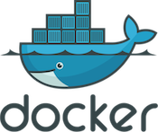

# Installing the Ambassador Edge Stack

The Ambassador Edge Stack can be installed in a variety of ways. Please see the relevant section below for details.

# Install on Mac / Linux / Windows 

In just four minutes, your cluster will be routing HTTPS requests from the Internet to a backend service. The Ambassador Edge Stack is deployed to Kubernetes via YAML for MacOS, Linux, and
Windows. 

### Install on MacOS 

1. Download the `edgectl` file [here](https://metriton.datawire.io/downloads/darwin/edgectl) or download it with a curl command:

    ```shell
    sudo curl -fL https://metriton.datawire.io/downloads/darwin/edgectl -o /usr/local/bin/edgectl && sudo chmod a+x /usr/local/bin/edgectl
    ```

    If you decide to download the file, you may encounter a security block. To change this:
    * Go to **System Preferences > Security & Privacy > General**.
    * Click the **Open Anyway** button.
    * On the new dialog, click the **Open** button.

2. Run the installer with `edgectl install`


### Install on Linux  

1. Download the `edgectl` file
   [here](https://metriton.datawire.io/downloads/linux/edgectl) or download it with a curl
   command:

    ```shell
    sudo curl -fL https://metriton.datawire.io/downloads/linux/edgectl -o /usr/local/bin/edgectl && sudo chmod a+x /usr/local/bin/edgectl
    ```
2. Run the installer with `edgectl install`

### Install on Windows 

1. Download the `edgectl.exe` file
   [here](https://metriton.datawire.io/downloads/windows/edgectl.exe).
2. Run the installer with `edgectl install`


## Setting up TLS

Your terminal will show you something similar to the following as the installer provisions
a load balancer, configures TLS, and provides you with an `edgestack.me` subdomain:


<div class="codeblockInstall">
$ <span class="userInputText">edgectl install</span><br/>
-> Installing the Ambassador Edge Stack $version$.<br/>
Downloading images. (This may take a minute.)<br/>

-> Provisioning a cloud load balancer. (This may take a minute, depending on
your cloud provider.)<br/>

Your AES installation's IP address is 4.3.2.1
-> Automatically configuring TLS<br/>

Please enter an email address. We'll use this email address to notify you prior
to domain and certificate expiration. We also share this email address with
Let's Encrypt to acquire your certificate for TLS.
</div>


Provide an email address as required by the ACME TLS certificate provider, Let's
Encrypt. Then your terminal will print something similar to the following:

<div class="codeblockInstall">
Email address [<span class="userInputText">john@example.com</span>]:<br/>

-> Acquiring DNS name random-word-3421.edgestack.me 
-> Obtaining a TLS certificate from Let's Encrypt 
-> TLS configured successfully

Congratulations! You've successfully installed the Ambassador Edge Stack in
your Kubernetes cluster. Visit <span class="userGuidanceText">random-word-3421.edgestack.me</span> to access your
Edge Stack installation and for additional configuration.
</div>

The `random-word-3421.edgestack.me` is a provided subdomain that allows the
Ambassador Edge Stack to automatically provision TLS and HTTPS for a domain
name, so you can get started right away.

Your new [Edge Policy Console](../../using/edge-policy-console) will open
automatically in your browser at the provided URL or IP address. 


**Note that the provided `random-word-3421.edgestack.me` domain name will expire after 90 days**.

## Kubernetes

Kubernetes via YAML is the most common approach to install with our default, customizable manifest. The Ambassador Edge Stack is designed to run in Kubernetes for production. **If you're new to Kubernetes and/or Ambassador, we recommend using this method.**

## Other Methods

You can also install the Ambassador Edge Stack using Helm, Docker, Bare Metal,
the Operator, or installing manually.

| [](helm) | [](docker) | [Kubernetes Bare Metal](bare-metal) | [AES Operator](aes-operator) | [YAML Install](yaml-install) |
|----------------|----------|----------------------|---------------------------|-------|
| Helm is a package manager for Kubernetes. The Ambassador Edge Stack comes pre-packaged as a Helm chart. [Install via Helm.](helm) | The Docker install will let you try the Ambassador Edge Stack locally in seconds, but is not supported for production. [Try with Docker.](docker) | Bare Metal can expose the Ambassador Edge Stack if you don't have a load balancer in place. [Install on Bare Metal.](bare-metal) | The Ambassador Edge Stack Operator automates install and updates, among other actions. [Install with the Operator](aes-operator) | If you want to configure specific parameters of your installation, use the [YAML installation method](yaml-install). |

Looking for just the API Gateway? [Install the Ambassador API Gateway](install-ambassador-oss).

## Installation Success

Congratulations, you've installed the Ambassador Edge Stack! Take advantage of
the quick start demo by [creating a mapping](../../../tutorials/quickstart-demo) on
your cluster using the Ambassador Edge Stack.

Ambassador offers a lot under the hood to help manage your edge policies.  Check out [core elements] (../../using) of interest to your team.

### What’s Next?

The Ambassador Edge Stack has a comprehensive range of [features](/features/) to
support the requirements of any edge microservice. To learn more about how the
Ambassador Edge Stack works, along with use cases, best practices, and more,
check out the [Welcome page](../../../) or read the [Ambassador
Story](../../../about/why-ambassador).

## Upgrade Options

If you already have the Ambassador Edge Stack, here are a few different ways you can upgrade your instance:


1. [Upgrade to the Ambassador Edge Stack from the API Gateway](upgrade-to-edge-stack).
2. [Upgrade your Ambassador Edge Stack instance](upgrading) to the latest version.