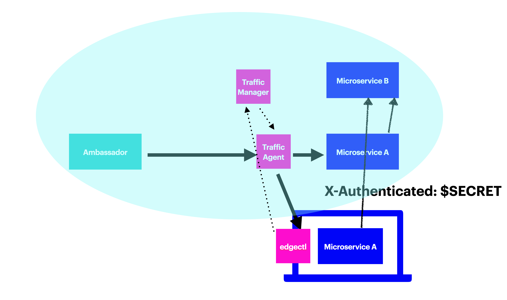

# Service Preview and Edge Control

One of the challenges in adopting Kubernetes and microservices is the development and testing workflow. Creating and maintaining a full development environment with many microservices and their dependencies is complex and hard.

Service Preview addresses this challenge by connecting your CI system or local development infrastructure to the Kubernetes cluster, and dynamically routing specific requests to your local environment.

## Service Preview in action



When Service Preview is used, incoming requests get routed by Ambassador to a Traffic Agent, which then routes traffic to the microservice. When a request meets a specific criteria (e.g., it has a specific HTTP header value), the Traffic Agent will route that request to the microservice running locally. The following video shows Service Preview in more detail:

<iframe width="560" height="315" src="https://www.youtube.com/embed/LDiyKOa1V_A" frameborder="0" allow="accelerometer; autoplay; encrypted-media; gyroscope; picture-in-picture" allowfullscreen></iframe>


## Preview URLs

Ambassador Edge Stack, when used as your cluster's API gateway, offers the ability to use preview URLs. Just as you can access your application at a specific URL, you can access the development version of the same application through a Preview URL. When AES detects a Preview URL at the edge, it rewrites the request to look like a normal request but with a service preview header added. 

## Service Preview Components

There are three main components to Service Preview:

1. The Traffic Agent, which controls routing to the microservice. The Traffic Agent is deployed as a sidecar on the same pod as your microservice (behind the scenes, it's a special configuration of the basic Ambassador Edge Stack image). The Traffic Agent sidecar can be manually configured or automatically injected in any pod with a specific annotation.

2. The Traffic Manager, which manages the different instances of the Traffic Agent, and is deployed in the cluster.

3. The Edge Control local client, which runs in your local environment (Linux or Mac OS X). The client is the command line interface to the Traffic Manager.

For Preview URLs to function, Ambassador Edge Stack must be running as your API gateway.

## Configuring Service Preview

To get started with Service Preview, you'll need to install Traffic Manager, configure a Traffic Agent, and then download and install the `edgectl` client.

To use Preview URLs, you must enable preview URL processing in one or more Host resources used by Ambassador Edge Stack.

### Traffic Manager

The Traffic Manager is the central point of communication between Traffic Agents in the cluster and Edge Control Daemons on developer workstations.


1. Ensure that you have a fully functional Ambassador Edge Stack installation with a valid license key installed in your cluster.
2. Save the manifest below into a file called `traffic-manager.yaml`.
3. Apply the manifest to your cluster with `kubectl apply -f traffic-manager.yaml`.

```yaml
# This is traffic-manager.yaml
---
apiVersion: v1
kind: ServiceAccount
metadata:
  name: traffic-manager
  namespace: ambassador
---
apiVersion: rbac.authorization.k8s.io/v1beta1
kind: ClusterRole
metadata:
  name: traffic-manager
rules:
  - apiGroups: [""]
    resources: ["namespaces", "services", "pods", "secrets"]
    verbs: ["get", "list", "watch"]
---
apiVersion: rbac.authorization.k8s.io/v1beta1
kind: ClusterRoleBinding
metadata:
  name: traffic-manager
roleRef:
  apiGroup: rbac.authorization.k8s.io
  kind: ClusterRole
  name: traffic-manager
subjects:
  - kind: ServiceAccount
    name: traffic-manager
    namespace: ambassador
---
apiVersion: v1
kind: Service
metadata:
  name: telepresence-proxy
  namespace: ambassador
spec:
  type: ClusterIP
  clusterIP: None
  selector:
    app: telepresence-proxy
  ports:
    - name: sshd
      protocol: TCP
      port: 8022
    - name: api
      protocol: TCP
      port: 8081
---
apiVersion: apps/v1
kind: Deployment
metadata:
  name: telepresence-proxy
  namespace: ambassador
  labels:
    app: telepresence-proxy
spec:
  replicas: 1
  selector:
    matchLabels:
      app: telepresence-proxy
  template:
    metadata:
      labels:
        app: telepresence-proxy
    spec:
      containers:
      - name: telepresence-proxy
        image: docker.io/datawire/aes:$version$
        command: [ "traffic-manager" ]
        ports:
          - name: sshd
            containerPort: 8022
        env:
          - name: AMBASSADOR_NAMESPACE
            valueFrom:
              fieldRef:
                fieldPath: metadata.namespace
          - name: REDIS_URL
            value: ambassador-redis:6379
        volumeMounts:
          - mountPath: /tmp/ambassador-pod-info
            name: ambassador-pod-info
      restartPolicy: Always
      serviceAccountName: traffic-manager
      terminationGracePeriodSeconds: 0
      volumes:
      - downwardAPI:
          items:
          - fieldRef:
              fieldPath: metadata.labels
            path: labels
        name: ambassador-pod-info
```

Note that if you do not wish to grant read privileges on `Secrets` to the `traffic-manager` `ServiceAccount`, you may mount the `ambassador-edge-stack` secret containing the license key in an extra volume and reference it using the `AMBASSADOR_LICENSE_FILE` environment variable:

```yaml
    env:
    - name: AMBASSADOR_LICENSE_FILE
      value: /.config/ambassador/license-key
   [...]
    volumeMounts:
    - mountPath: /.config/ambassador
      name: ambassador-edge-stack-secrets
      readOnly: true
   [...]
  volumes:
  - name: ambassador-edge-stack-secrets
    secret:
      secretName: ambassador-edge-stack
``` 

### Traffic Agent

Any microservice running in a cluster with a traffic manager can opt in to intercept functionality by including the Traffic Agent in its pods.

#### Configuring RBAC

Since the Traffic Agent is built on Ambassador Edge Stack, it needs a subset of the same RBAC permissions that Ambassador does. The easiest way to provide this is to create a `ServiceAccount` in your service's namespace, bound to the `traffic-agent` `Role` or `ClusterRole`:

```yaml
---
apiVersion: v1
kind: ServiceAccount
metadata:
  name: traffic-agent
  namespace: default
  labels:
    product: aes
---
## After creating the ServiceAccount, create a service-account-token for traffic-agent with a matching name.
## Since the ambassador-injector will use this token name, it must be deterministic and not auto-generated.
apiVersion: v1
kind: Secret
metadata:
  name: traffic-agent
  namespace: default
  annotations:
    kubernetes.io/service-account.name: traffic-agent
type: kubernetes.io/service-account-token
---
apiVersion: rbac.authorization.k8s.io/v1beta1
kind: ClusterRole
metadata:
  name: traffic-agent
rules:
  - apiGroups: [""]
    resources: [ "namespaces", "services", "secrets" ]
    verbs: ["get", "list", "watch"]
  - apiGroups: [ "getambassador.io" ]
    resources: [ "*" ]
    verbs: ["get", "list", "watch", "update"]
---
apiVersion: rbac.authorization.k8s.io/v1beta1
kind: ClusterRoleBinding
metadata:
  name: traffic-agent
  labels:
    product: aes
roleRef:
  apiGroup: rbac.authorization.k8s.io
  kind: ClusterRole
  name: traffic-agent
subjects:
  - name: traffic-agent
    namespace: default
    kind: ServiceAccount
```

Copy the above YAML into `traffic-agent-rbac.yaml` and, if necessary, edit the two `namespace`s appropriately. Apply it:

```bash
$ kubectl apply -f traffic-agent-rbac.yaml
serviceaccount/traffic-agent created
clusterrolebinding.rbac.authorization.k8s.io/traffic-agent created
```

If you want to include the Traffic Agent with multiple services, they can all use the same `ServiceAccount` name, as long as it exists in every namespace.

Alternatively, if you already have specific `ServiceAccounts` defined for each of your pod, you may grant all of them the additional `traffic-agent` permissions:

```yaml
---
apiVersion: rbac.authorization.k8s.io/v1beta1
kind: ClusterRoleBinding
metadata:
  name: traffic-agent
  labels:
    product: aes
roleRef:
  apiGroup: rbac.authorization.k8s.io
  kind: ClusterRole
  name: traffic-agent
subjects:
  - name: system:serviceaccounts
    kind: Group
    apiGroup: rbac.authorization.k8s.io
``` 

#### Manual Traffic Agent Sidecar Configuration

You'll need to modify the YAML for each microservice to include the Traffic Agent. We'll start with a set of manifests for a simple microservice:

```yaml
# This is hello.yaml
---
apiVersion: v1
kind: Service
metadata:
  name: hello
  labels:
    app: hello
spec:
  selector:
    app: hello
  ports:
    - protocol: TCP
      port: 80
      targetPort: http              # Application port
---
apiVersion: apps/v1
kind: Deployment
metadata:
  name: hello
  labels:
    app: hello
spec:
  replicas: 1
  selector:
    matchLabels:
      app: hello
  template:
    metadata:
      labels:
        app: hello
    spec:
      containers:                   # Application container
        - name: hello
          image: datawire/hello-world:latest
          ports:
            - name: http
              containerPort: 8000   # Application port
```

In order to run the sidecar:
- you need to include the Traffic Agent container in the microservice pod;
- you need to switch the microservice's `Service` definition to point to the Traffic Agent's listening port (using named ports such as `http` or `https` allow us to change the `Pod` definition without changing the `Service` definition); and
- you need to tell the Traffic Agent how to set up for the microservice, using environment variables.

Here is a modified set of manifests that includes the Traffic Agent (with notes below):

```yaml
# This is hello-intercept.yaml
---
apiVersion: v1
kind: Service
metadata:
  name: hello
  labels:
    app: hello
spec:
  selector:
    app: hello
  ports:
    - protocol: TCP
      port: 80
      targetPort: http              # Traffic Agent listen port (note 1)
---
apiVersion: apps/v1
kind: Deployment
metadata:
  name: hello
  labels:
    app: hello
spec:
  replicas: 1
  selector:
    matchLabels:
      app: hello
  template:
    metadata:
      labels:
        app: hello
    spec:
      containers:
        - name: hello               # Application container (note 2)
          image: datawire/hello-world:latest
          ports:
            - containerPort: 8000   # Application port
        - name: traffic-agent       # Traffic Agent container (note 3)
          image: docker.io/datawire/aes:$version$ # (note 4)
          ports:
            - name: http
              containerPort: 9900   # Traffic Agent listen port
          env:
          - name: AGENT_SERVICE     # Name to use for intercepting (note 5)
            value: hello
          - name: AGENT_PORT        # Port on which to talk to the microservice (note 6)
            value: "8000"
          - name: AGENT_MANAGER_NAMESPACE # Namespace for contacting the Traffic Manager (note 7)
            value: ambassador
          - name: AMBASSADOR_NAMESPACE # Namespace in which this microservice is running (note 8)
            valueFrom:
              fieldRef:
                fieldPath: metadata.namespace
          - name: AMBASSADOR_SINGLE_NAMESPACE # Traffic Agent container can run in a single-namespace (note 9)
            value: "true"
          - name: AGENT_LISTEN_PORT # Port on which to listen for connections (note 10)
            value: "9900"
      serviceAccountName: traffic-agent # The pod runs with traffic-agent RBAC
```

Key points include:

- **Note 1**: The `Service` now points to the Traffic Agent’s listen port (named `http`, 9900) instead of the application’s port (8000).
- **Note 2**: The microservice's application container is actually unchanged.
- **Note 3**: The Traffic Agent's container has been added.
- **Note 4**: The Traffic Agent is included in the AES image.
- **Note 5**: The `AGENT_SERVICE` environment variable is mandatory. It sets the name that the Traffic Agent will report to the Traffic Manager for this microservice: you will have to provide this name to intercept this microservice.
- **Note 6**: The `AGENT_PORT` environment variable is mandatory. It tells the Traffic Agent the local port on which the microservice is listening.
- **Note 7**: The `AGENT_MANAGER_NAMESPACE` environment variable tells the Traffic Agent the namespace in which it will be able to find the Traffic Manager. If not present, it defaults to the `ambassador` namespace.
- **Note 8**: The `AMBASSADOR_NAMESPACE` environment variable is mandatory. It lets the Traffic Agent tell the Traffic Manager the namespace in which the microservice is running. 
- **Note 9**: The `AMBASSADOR_SINGLE_NAMESPACE` environment variable tells the Traffic Agent to watch resources only in its current namespace. This allows the `traffic-agent` `ServiceAccount` to only have `Role` permissions instead of a cluster-wide `ClusterRole`.
- **Note 10**: The `AGENT_LISTEN_PORT` environment variable tells the Traffic Agent the port on which to listen for incoming connections. The `Service` must point to this port (see Note 1). If not present, it defaults to port 9900.

#### Automatic Traffic Agent Sidecar Injection

If you wish to allow automatic Traffic Agent sidecar injection in any deployment without having to manually configure the extra container, you may install the `ambassador-injector` AdmissionController:

1. Generate a (self-signed) TLS certificate and key to be used by the webhook server. The certificate will be issued for the Common Name (CN) of `ambassador-injector.ambassador.svc`, which is the cluster-internal DNS name for the service. TLS is mandatory when using a `MutatingWebhookConfiguration`. The certificates generated in this example are valid for 365 days:
    ```shell script
    # Generate the CA cert and private key
    openssl req -days 365 -nodes -new -x509 -keyout ca.key -out ca.crt \
      -subj "/CN=Ambassador Edge Stack Admission Controller Webhook CA"
    # Generate the private key for the webhook server
    openssl genrsa -out key.pem 2048
    # Generate a Certificate Signing Request (CSR) for the private key, and sign it with the private key of the CA.
    openssl req -new -key key.pem -subj "/CN=ambassador-injector.ambassador.svc" \
        | openssl x509 -req -days 365 -CA ca.crt -CAkey ca.key -CAcreateserial -out crt.pem
    
    # Encode the certificates
    cat ca.crt | base64 > ca.bundle.base64
    cat key.pem | base64 > key.pem.base64
    cat crt.pem | base64 > crt.pem.base64
    ```
2. Replace the `CA_BUNDLE_BASE64`, `CRT_PEM_BASE64` and `KEY_PEM_BASE64` placeholders using the values from above, and save the manifest below into a file called `ambassador-injector.yaml`.
3. Apply the manifest to your cluster with `kubectl apply -f ambassador-injector.yaml`.

```yaml
---
kind: Secret
apiVersion: v1
metadata:
  name: ambassador-injector-tls
  namespace: ambassador
type: Opaque
data:
  crt.pem: CRT_PEM_BASE64
  key.pem: KEY_PEM_BASE64
---
apiVersion: apps/v1
kind: Deployment
metadata:
  name: ambassador-injector
  namespace: ambassador
spec:
  replicas: 1
  selector:
    matchLabels:
      app.kubernetes.io/name: ambassador-injector
      app.kubernetes.io/instance: ambassador
  template:
    metadata:
      labels:
        app.kubernetes.io/name: ambassador-injector
        app.kubernetes.io/instance: ambassador
    spec:
      containers:
        - name: webhook
          image: quay.io/datawire/aes:$version$
          command: [ "aes-injector" ]
          env:
            - name: TRAFFIC_AGENT_IMAGE                # Mandatory. The Traffic Agent is included in the AES image.
              value: quay.io/datawire/aes:$version$
            - name: TRAFFIC_AGENT_SERVICE_ACCOUNT_NAME # Optional. The Injector can configure the sidecar to use a specific ServiceAccount and service-account-token. if unspecified, the original Pod ServiceAccount is used.
              value: traffic-agent
            - name: TRAFFIC_AGENT_AGENT_LISTEN_PORT    # Optional. The port on which the Traffic Agent will listen. Defaults to "9900".
              value: "9900"
            - name: AGENT_MANAGER_NAMESPACE            # Optional. Namespace for contacting the Traffic Manager. Defaults to "ambassador".
              value: ambassador
          ports:
            - containerPort: 8443
              name: https
          livenessProbe:
            httpGet:
              path: /healthz
              port: https
              scheme: HTTPS
          volumeMounts:
            - mountPath: /var/run/secrets/tls
              name: tls
              readOnly: true
      volumes:
        - name: tls
          secret:
            secretName: ambassador-injector-tls
---
apiVersion: v1
kind: Service
metadata:
  name: ambassador-injector
  namespace: ambassador
spec:
  type: ClusterIP
  selector:
    app.kubernetes.io/name: ambassador-injector
    app.kubernetes.io/instance: ambassador
  ports:
    - name: ambassador-injector
      port: 443
      targetPort: https
---
apiVersion: admissionregistration.k8s.io/v1beta1
kind: MutatingWebhookConfiguration
metadata:
  name: ambassador-injector-webhook-config
webhooks:
  - name: ambassador-injector.getambassador.io
    clientConfig:
      service:
        name: ambassador-injector
        namespace: ambassador
        path: "/traffic-agent"
      caBundle: CA_BUNDLE_BASE64
    failurePolicy: Ignore
    rules:
      - operations: ["CREATE"]
        apiGroups: [""]
        apiVersions: ["v1"]
        resources: ["pods"]
```

Once the `ambassador-injector` is installed, you may modify your service manifest to include automatic Traffic Agent sidecar injection. Using the example `hello.yaml` deployment from above, enabling sidecar injection is easy using the `getambassador.io/inject-traffic-agent: enabled` annotation on any Pod definition:

```yaml
# This is hello-automatic-injection.yaml
---
apiVersion: v1
kind: Service
metadata:
  name: hello
  labels:
    app: hello
spec:
  selector:
    app: hello
  ports:
    - protocol: TCP
      port: 80
      targetPort: http              # Application port
---
apiVersion: apps/v1
kind: Deployment
metadata:
  name: hello
  labels:
    app: hello
spec:
  replicas: 1
  selector:
    matchLabels:
      app: hello
  template:
    metadata:
      annotations:
        getambassador.io/inject-traffic-agent: enabled # Enable automatic Traffic Agent sidecar injection
      labels:
        app: hello
    spec:
      containers:                   # Application container
        - name: hello
          image: datawire/hello-world:latest
          ports:
            - name: http
              containerPort: 8000   # Application port unchanged, ambassador-injector will detect named ports `http` and `https` and reconfigure port settings on the Pod.
```

#### TLS Support

If other microservices in the cluster expect to speak TLS to this microservice, tell the Traffic Agent to terminate TLS:
- Set the `AGENT_TLS_TERM_SECRET` environment variable, or the `getambassador.io/inject-terminating-tls-secret` pod annotation if using `ambassador-injector`, to the name of a Kubernetes Secret that contains a TLS certificate
- The Traffic Agent will terminate TLS on its listen port (named `https` instead of `http`; 9900 by default) using the named certificate
- The Traffic Agent will not accept cleartext communication when configured to terminate TLS

If this microservice expects incoming requests to speak TLS, tell the Traffic Agent to originate TLS:
- Set the `AGENT_TLS_ORIG_SECRET` environment variable, or the `getambassador.io/inject-originating-tls-secret` pod annotation if using `ambassador-injector`, to the name of a Kubernetes Secret that contains a TLS certificate
- The Traffic Agent will use that certificate originate HTTPS requests to the application

### Ambassador Edge Stack

To enable Preview URLs, you must first enable preview URL processing in one or more Host resources. Ambassador Edge Stack uses Host resources to configure various aspects of a given host. Enabling preview URLs is as simple as adding the `previewURL` section and setting `enabled` to `true`:

```yaml
apiVersion: getambassador.io/v2
kind: Host
metadata:
  name: minimal-host
spec:
  hostname: host.example.com
  acmeProvider:
    email: julian@example.com
  previewUrl:
    enabled: true
```
